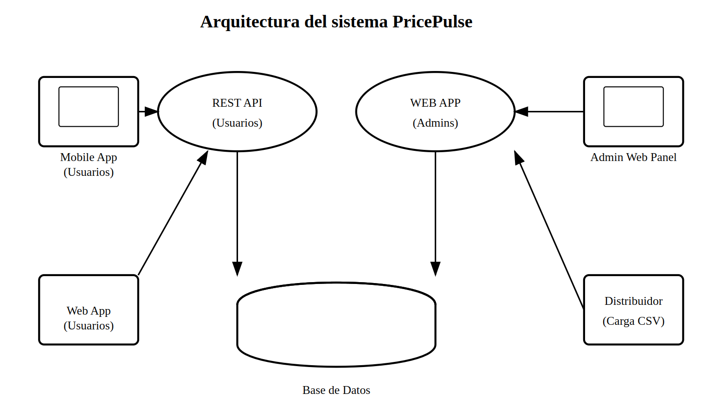

# PricePulse


## 1. Introducción

El proyecto **PricePulse** es un software que tiene como objetivo proporcionar precios actualizados en tiempo real a los vendedores del distribuidor.

## 1.1 Propósito

El propósito de este documento es describir los requisitos para la aplicación que los vendedores utilizarán a diario. Este documento será utilizado por todas las partes interesadas, desarrolladores y testers.

## 1.2 Alcance

El alcance de este proyecto se limita a las pruebas de las funcionalidades descritas en las secciones siguientes de este documento.  
Las pruebas no funcionales como las de estrés o rendimiento están fuera del alcance del proyecto.  
Las pruebas automatizadas también están fuera del alcance.  
Las pruebas funcionales y una interfaz externa básica están dentro del alcance y deben ser evaluadas.

## 1.3 Definiciones, Acrónimos y Abreviaturas

| Abreviación | Significado     |
|-------------|-----------------|
| A           | Administrador   |
| D           | Distribuidor    |
| D           | Desarrollador   |
| S           | Stakeholder     |
| T           | Tester (Evaluador) |
| V           | Vendedor        |

## 2. Requisitos

### 2.1 Descripción de Roles

| Rol              | Descripción                                                                 |
|------------------|-----------------------------------------------------------------------------|
| **Vendedor**     | Usuario de la aplicación móvil. Consulta precios de productos en tiempo real. |
| **Distribuidor** | Proporciona datos actualizados de productos que serán consumidos por la app. |
| **Administrador**| Gestiona el acceso de usuarios y la configuración del sistema.              |
| **Tester**       | Valida que la aplicación se comporte según los requisitos especificados.     |
| **Desarrollador**| Implementa y mantiene las funcionalidades de la app basándose en las necesidades de los stakeholders. |

### 2.2 Funcionalidades por Rol

| Rol              | Funcionalidades                                                                             |
|------------------|---------------------------------------------------------------------------------------------|
| **Vendedor**     | - Buscar productos por código o nombre  <br> - Ver precios actualizados en tiempo real     |
| **Administrador**| - Gestionar cuentas de vendedores  <br> - Restablecer contraseñas  <br> - Monitorizar el estado del sistema |
| **Tester**       | - Ejecutar casos de prueba funcionales  <br> - Reportar errores  <br> - Verificar correcciones |
| **Desarrollador**| - Desarrollar la API del backend  <br> - Implementar componentes del frontend  <br> - Corregir errores |
| **Distribuidor** | - Cargar actualizaciones de precios al sistema  <br> - Asegurar la precisión de los datos |


### 2.3 User Stories 
#### User Story 1: Buscar productos por nombre o código

**Como** vendedor,  
**quiero** buscar productos por nombre o código  
**para** acceder rápidamente a la información del precio.

**Criterios de Aceptación**

- **Escenario 1 (Positivo):**  
  **Dado que** el vendedor está en la pantalla de búsqueda,  
  **cuando** introduce un código o nombre válido y presiona buscar,  
  **entonces** se muestra la información del producto y su precio.
- **Escenario 2 (Negativo):**  
  **Dado que** el vendedor introduce un código incorrecto,  
  **cuando** presiona buscar,  
  **entonces** se muestra un mensaje de "Producto no encontrado".

---

#### User Story 2: Ver precios más recientes

**Como** vendedor,  
**quiero** tener la seguridad de que estoy viendo los precios más recientes  
**para** evitar vender con precios desactualizados.

**Criterios de Aceptación**

- Mostrar la fecha de última actualización junto al precio.
- Actualización automática de precios al abrir la pantalla o tras un intervalo predeterminado.

---

#### User Story 3: Cargar listas de precios

**Como** distribuidor,  
**quiero** poder cargar las nuevas listas de precios  
**para** mantener a mis vendedores actualizados.

**Criterios de Aceptación**

- Poder subir archivos de lista de precios en formatos como Excel (.xlsx, .xls) y CSV.  
- Validación de formato y datos (p. ej. columnas requeridas: código, nombre, precio).  
- Mostrar un mensaje de "Actualización exitosa" o, en caso de error, "Error al procesar el archivo" con detalles.  
- Registro de fecha y usuario que realizó la carga.


### 2.4 Test cases

####  User Story 1: Buscar productos por nombre o código
TestCase-1.1 - Búsqueda exitosa por nombre o código
Precondiciones: El usuario está en la pantalla de búsqueda

Pasos:
Ingresar un nombre o código válido en el campo de búsqueda
Presionar el botón "Buscar".
Entrada: "123ABC" o "Coca Cola"
Resultado esperado: Se muestra la información del producto con su precio

TestCase-1.2 - Búsqueda con código inválido
Precondiciones: El usuario está en la pantalla de búsqueda

Pasos:
Ingresar un código inválido
Presionar el botón "Buscar"
Entrada: "ZZZ000"
Resultado esperado: Se muestra mensaje "Producto no encontrado"


#### User Story 2: Ver precios más recientes
TestCase-2.1 - Mostrar fecha de última actualización
Precondiciones: El usuario visualiza un producto

Pasos:
Ingresar al detalle de producto
Resultado esperado: Se muestra la fecha de última actualización del precio

TestCase-2.2 - Validar actualización automática
Precondiciones: La lista de precios fue actualizada en el servidor

Pasos:
Abrir la app con conexión a Internet
Esperar a que se cargue la información
Resultado esperado: Se muestran los precios actualizados automáticamente


#### User Story 3: Cargar listas de precios
TestCase-3.1 - Subir lista de precios (formato válido)
Precondiciones: El usuario tiene acceso de administrador

Pasos:
Subir archivo Excel válido
Presionar "Cargar"
Resultado esperado: Mensaje "Lista cargada exitosamente"

TestCase-3.2 - Subir lista de precios (formato inválido)

Pasos:
Subir un archivo con formato incorrecto o datos faltantes
Resultado esperado: Se muestra error con detalle del problema

### 3. Technical Specifications

#### 3.1 Arquitectura del Sistema

**Nota:** Esta sección será completada en futuras actualizaciones del documento.

La aplicación está compuesta por una base de datos central y dos interfaces diferenciadas según el perfil de usuario. Por un lado, se desarrollará una **aplicación web exclusiva para administradores**, quienes serán responsables de cargar y actualizar las listas de precios. Por otro lado, se implementará una **aplicación móvil destinada a los vendedores**, diseñada para facilitar la consulta rápida y actualizada de precios durante sus visitas a clientes.

Dado que la web app será utilizada únicamente por uno o dos administradores, y considerando que la API pública estará orientada a la distribución de la lista de precios para los vendedores, **no resulta necesario implementar un sistema complejo de autenticación y gestión de usuarios para la interfaz administrativa**. En este sentido, se optará por desarrollar una **API separada, restringida y segura**, exclusivamente para la administración de precios, evitando así exponer funcionalidades innecesarias a la red pública.





#### 3.2 Definición de API

El sistema PricePulse expone una API RESTful que permite:

- A los **vendedores**, buscar productos por código o nombre y visualizar precios actualizados en tiempo real.  
- A los **distribuidores**, subir nuevas listas de precios para mantener la información actualizada.

La especificación completa de la API está definida utilizando el formato **OpenAPI (Swagger)** y puede consultarse en el siguiente documento: **[PricePulse API Contract]**.

**Endpoints principales:**

- `GET /products?search={name}`  
  Permite a los vendedores buscar productos por nombre o código.  
  **Parámetro:** `name`
  **Respuesta:** Listado de productos y precio actual

- `GET /products/{code}`
  Permite a los vendedores buscar productos por nombre o código.  
  **Parámetro:** `code`  
  **Respuesta:** Información del producto y precio actual


**Manejo de errores:**  
Las respuestas incluirán códigos HTTP estándar y mensajes detallados en caso de errores (por ejemplo, `400 Bad Request`, `500 Internal Server Error`).

Para más detalles sobre los parámetros de las peticiones, formatos de respuesta y ejemplos de uso, consultar el contrato de la API mencionado anteriormente.

### 4. Running the Project

#### 4.1 Backend Setup

1. Navigate to the backend directory:
   ```bash
   cd backend
   ```

2. Create and activate a virtual environment (recommended):
   ```bash
   python -m venv venv
   source venv/bin/activate  # On Linux/Mac
   # or
   .\venv\Scripts\activate  # On Windows
   ```

3. Install dependencies:
   ```bash
   pip install -r requirements.txt
   ```

4. Run the application:
   ```bash
   python -m app.main
   ```

5. Run tests (optional):
   ```bash
   make test-item  # Run item model tests
   make test-service  # Run service tests
   ```

#### 4.2 Frontend Setup

1. Navigate to the frontend directory:
   ```bash
   cd frontend
   ```

2. Install dependencies:
   ```bash
   npm install
   ```

3. Start the development server:
   ```bash
   npm run dev
   ```

The application should now be running with:
- Backend API at: http://localhost:8000
- Frontend at: http://localhost:3000


